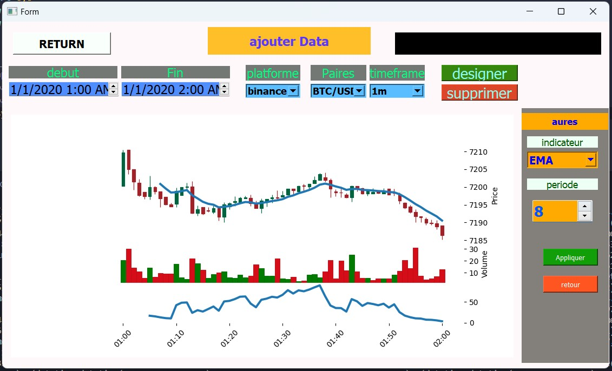
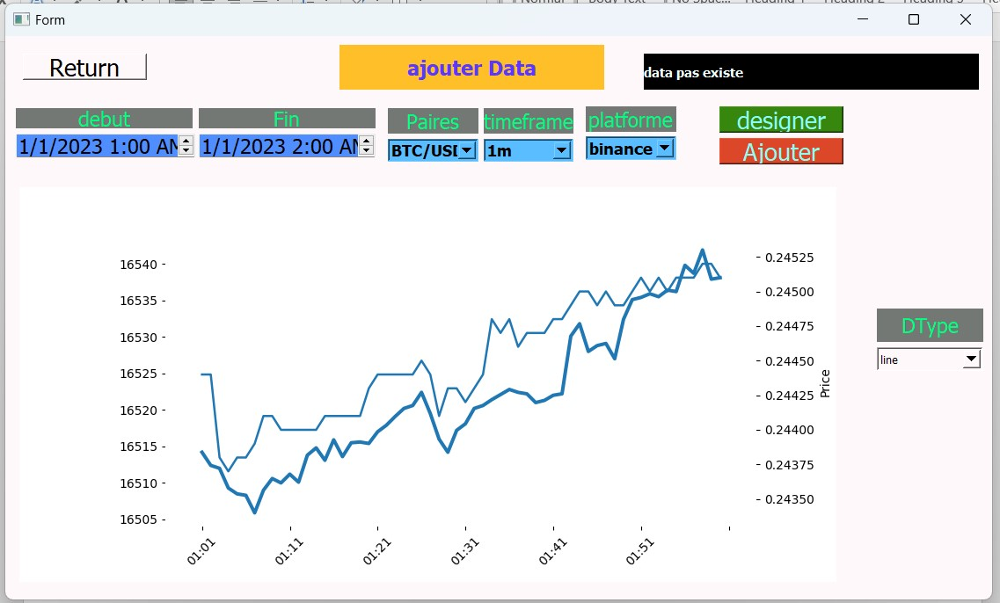
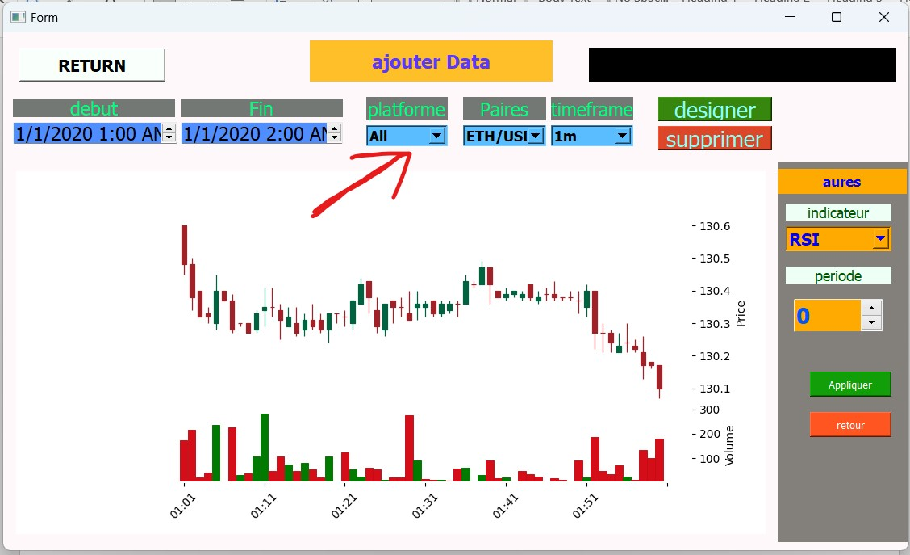
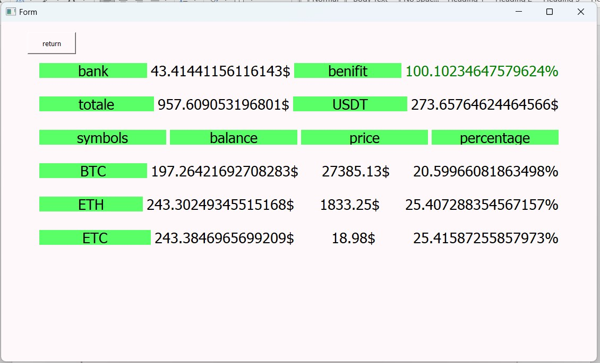
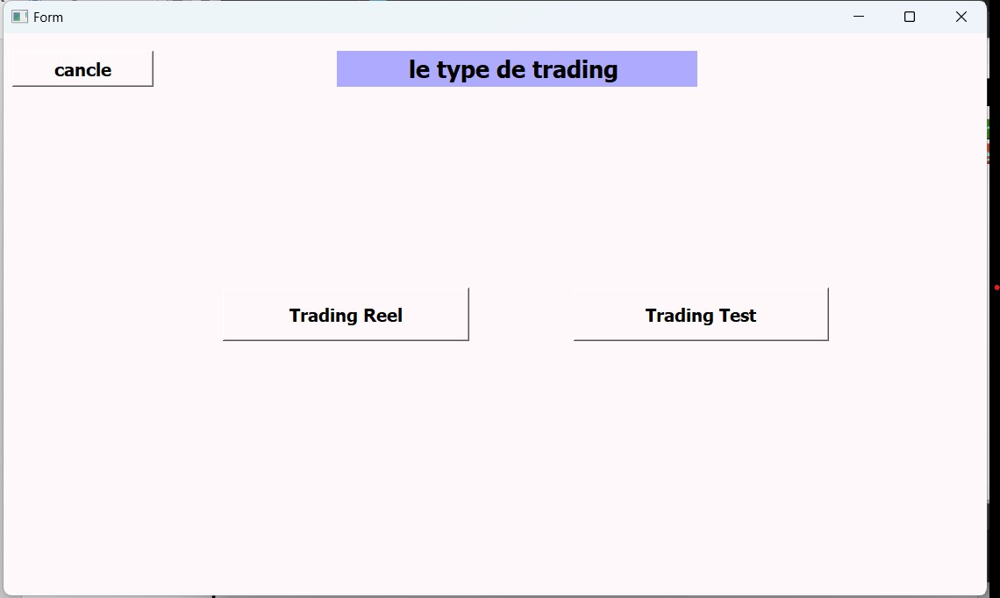

# Trading Portfolio Management Platform

## Overview

This application is designed for managing trader accounts across multiple trading platforms, employing a smart strategy to minimize risk and maximize benefits. It includes a lab for testing custom strategies with real-time stock market data and provides metrics for visualizing and analyzing the stock market with real data.

## Features

- **Trading Data Visualization:** View trading data for selected currency pairs, customizable with various indicators.
  
  
  
- **Currency Pair Comparison:** Compare data from multiple currency pairs on the same graph.
  
  
  
- **Portfolio Overview:** Our application includes an 'All' option, which allows users to visualize data for selected currency pairs across all trading platforms.
  
  
  
- **Portfolio Management:** Use a high-level risk management algorithm to manage and grow your portfolio.
  
  
  
- **Strategy Testing:** Test your portfolio management strategy in a simulated environment before real-world deployment.
  
  
  

## Technologies

- **PyQt5:** For the application’s graphical user interface.
- **CCXT API:** For accessing trading data from various platforms.
- **Pandas:** For data manipulation and analysis.
- **MySQL:** For data storage and management.
- **Matplotlib:** For data visualization.

## Links

- Sidi Mohammed Ben Abdellah University-Fez [FSDM:](https://www.fsdm.usmba.ac.ma/)
- LinkedIn [Maazouz AbdelAziz:](https://www.linkedin.com/in/abdelaziz-maazouz/)
- LinkedIn [Ladraoui Anass:](https://www.linkedin.com/in/anas-ladraoui-105b75223/)
  
---

